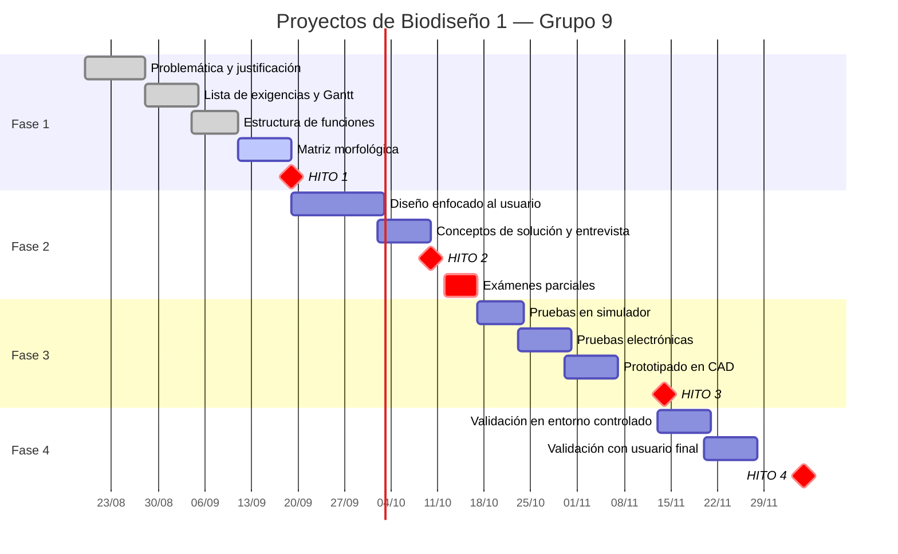

# 5. Diagrama de Gantt

[← Volver al Hito 1](README.md)

Planificación del proyecto por fases, del 19 de agosto al 5 de diciembre de 2026.

---

## Cronograma

---

## Detalle por semana

| Sem. | Fase | Tarea | Qué se debe realizar | Encargados | Inicio | Fin | Estado |
|:--:|:--:|---|---|---|---|---|---|
| 1 | 1 | Problemática – Justificación | Identificar y justificar un problema real de salud con datos que sustenten su relevancia, y definir el público objetivo afectado | Taline | 19/08 | 28/08 | ✅ Completada |
| 2 | 1 | Lista de exigencias · Actualización de Gantt | Revisar el estado de la tecnología, analizar la situación del problema, verificar posibilidades de realización, completar / ordenar / cuantificar las exigencias y planear el desarrollo | Todos | 28/08 | 05/09 | ✅ Completada |
| 3 | 1 | Estructura de funciones | Caja negra, secuencia de operaciones, procesos técnicos y sus limitaciones; mejorar, evaluar, decidir y verificar la estructura de funciones óptima | Todos | 04/09 | 11/09 | ✅ Completada |
| 4 | 1 | Matriz morfológica | Descomponer el proyecto en funciones clave, listar alternativas de solución para cada una y estructurarlas en una matriz para evaluar combinaciones | Todos | 11/09 | 19/09 | 🔄 En curso |
| 5 | 1 | **Hito 1** | Subir informe y presentación a la carpeta `H1/` del GitHub y a Blackboard | Todos | 19/08 | 19/09 | 🔄 En curso |
| 6 | 2 | Diseño enfocado al usuario | Comprender necesidades, comportamientos y limitaciones del público objetivo mediante técnicas de empatía | Todos | 19/09 | 03/10 | ⬜ No iniciada |
| 7 | 2 | Conceptos de solución · Entrevista al usuario | Diseñar y aplicar un cuestionario cualitativo, validar hipótesis del problema e identificar necesidades reales | Todos | 02/10 | 10/10 | ⬜ No iniciada |
| 8 | 2 | **Hito 2** | Subir informe y presentación a la carpeta `H2/` | Todos | 19/09 | 10/10 | ⬜ No iniciada |
| 9 | — | Semana de exámenes parciales | — | — | 12/10 | 17/10 | ⬜ No iniciada |
| 10 | 3 | Pruebas en simulador | Evaluar comportamiento, rendimiento y seguridad de los conceptos bajo condiciones críticas controladas | Todos | 17/10 | 24/10 | ⬜ No iniciada |
| 11 | 3 | Pruebas electrónicas | Implementar y evaluar los circuitos mediante simulación y protoboard: voltajes, corrientes, continuidad y lógica de operación | Todos | 23/10 | 31/10 | ⬜ No iniciada |
| 12 | 3 | Prototipado en CAD | Renders, animaciones de ensamble y planos mecánicos a partir del modelo 3D | Todos | 30/10 | 07/11 | ⬜ No iniciada |
| 13 | 3 | **Hito 3** | Subir informe y presentación a la carpeta `H3/` | Todos | 23/10 | 14/11 | ⬜ No iniciada |
| 14 | 4 | Validación de prototipo funcional | Pruebas técnicas integrales en entorno controlado: sistemas mecánico, electrónico y de software | Todos | 13/11 | 21/11 | ⬜ No iniciada |
| 15 | 4 | Validación de prototipo funcional | Pruebas de campo con el usuario final: usabilidad, eficiencia y cumplimiento de requerimientos | Todos | 20/11 | 28/11 | ⬜ No iniciada |
| 16 | 4 | **Hito 4** | Subir informe y presentación a la carpeta `H4/` | Todos | 13/11 | 05/12 | ⬜ No iniciada |

---

## Notas sobre el cronograma

> ⚠️ **El cronograma original está fechado al 11/09/2026.** En él, "Estructura de funciones"
> figuraba *En curso* y el Hito 1 *No iniciada*. Aquí se actualizaron esos dos estados a la
> situación real. Conviene revisar el resto antes de la entrega.

**Observaciones sobre la planificación:**

- La **matriz morfológica** (semana 4) cierra el mismo día que se entrega el Hito 1. Es la tarea
  con menos holgura de la Fase 1.
- Las semanas 11 y 12 (**pruebas electrónicas** y **prototipado CAD**) se solapan un día. Dado
  que las lleva la misma persona en distintos roles, conviene verificar que no haya conflicto.
- El **Hito 3** tiene una ventana larga (23/10 – 14/11) que se superpone con el inicio de la
  Fase 4. Es el punto de mayor riesgo de acumulación del semestre.
- La construcción del **phantom de validación** no aparece explícitamente como tarea. Debería
  arrancar antes de la semana 14, porque la validación funcional depende de él.

---

## Archivo fuente

El Gantt original del equipo está en formato Excel. Al actualizarlo, conviene actualizar
también el bloque Mermaid de arriba: GitHub lo renderiza automáticamente y permite ver el
historial de cambios del cronograma.

---

[← Anterior: Estructura de funciones](04-estructura-de-funciones.md) · [Volver al Hito 1](README.md)
